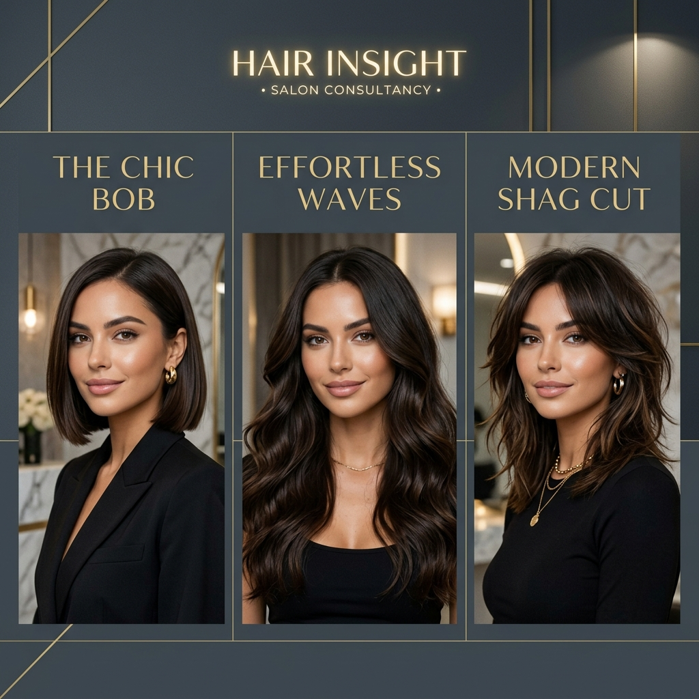
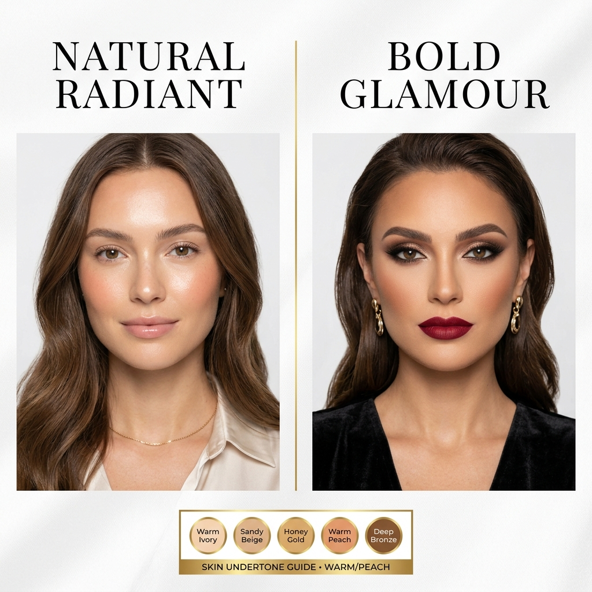
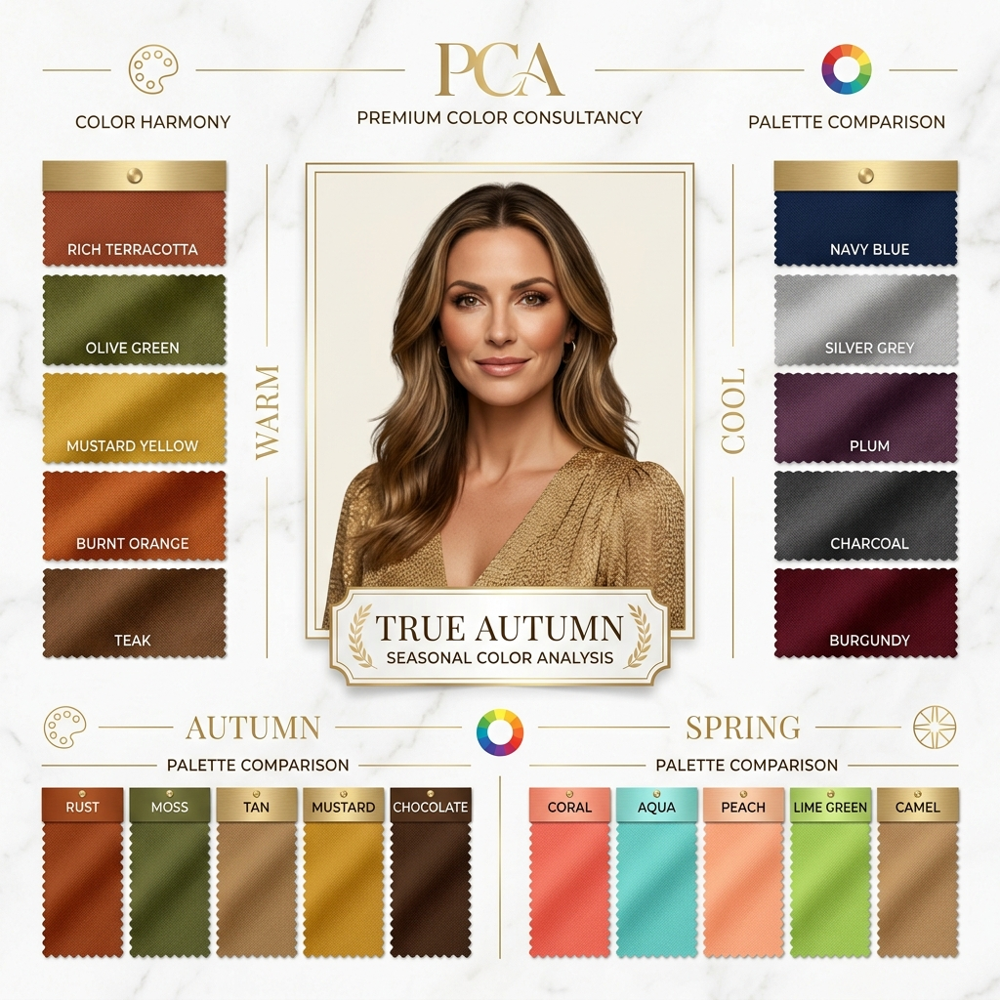

# AI Styling Studio - Feature Documentation

## Overview
The **AI Styling Studio** is an MVP feature built into the Admin Consultation Dashboard of The Hideaway. It empowers stylists and administrators to generate AI-driven visual analyses of a client's portrait. Instead of manual mockups, the system leverages locally-run AI image generation models to produce high-quality, side-by-side comparisons of hairstyles and makeup variations, which are then sent to the client via the consultation chat.

## UX Flow
1. **Trigger:** The Admin navigates to a specific pending or approved consultation in the Dashboard (`/admin/consultations/[id]`).
2. **Action:** In the left-hand panel under "AI Studio", the Admin selects:
   - `Generate Hairstyle Options`
   - `Generate Makeup Options`
   - *(Optional Future Expansion: Personal Color Analysis)*
3. **Processing:** The system takes the client's `CURRENT HAIR` image (base64) and sends it to a local AI Image Generation model alongside a strictly defined system prompt.
4. **Delivery:** The generated infographic/variation image is uploaded to the Supabase `consultation_images` storage bucket.
5. **Presentation:** A new message is automatically inserted into the chat as the "Stylist", embedding the generated image for the client to review.

## Core Prompts (Optimized for Local/Image Generation)
To ensure the local AI model generates clean, "visual-first" consultancy reports without unnecessary paragraphs of text, we utilize strict prompts. After testing with image generation, we have optimized the prompt to ensure better grid layouts and side-by-side comparisons.

### 1. Hairstyle Analysis
*   **Purpose:** Shows side-by-side hairstyle variations on the client's face shape.
*   **Mockup:**


### 2. Visual Makeup Analysis
*   **Purpose:** Suggests makeup looks that complement the new hair color.
*   **Mockup:**


### 3. Personal Color Analysis
*   **Purpose:** Identifies the user's seasonal color palette to guide overall styling.
*   **Mockup:**


## Implementation Status
- [x] Admin UI Integration (Sidebar Buttons)
- [x] Mockup Generation Workflow
- [x] Supabase Chat Integration
- [ ] Local AI Model Integration (SDAPI/Fooocus)

## Technical Architecture (MVP)

### 1. Frontend Integration
- **Component:** `app/admin/consultations/[id]/page.tsx`
- **UI Elements:** Action buttons located in the `AI Studio` section.
- **State Management:** Buttons will feature a loading spinner and disable state while awaiting the local API response to prevent duplicate generations.

### 2. Backend Pipeline
- **Endpoint:** `POST /api/ai/generate-visuals`
- **Payload:** `{ consultationId: string, type: 'hairstyle' | 'makeup', imageUrl: string }`
- **Logic:**
  1. Fetch the image from the provided URL and convert it to the format required by the local model (e.g., base64).
  2. Send the image and the corresponding prompt to the `LOCAL_IMAGE_MODEL_URL` (e.g., Stable Diffusion API endpoint).
  3. Receive the generated image blob/base64.
  4. Upload the generated image to Supabase Storage (`consultation_images`).
  5. Insert a new record into the `consultation_messages` table referencing the new image URL, attributed to the stylist.

### 3. Environment Variables
To ensure the feature can run flexibly across different local setups without code changes, the following environment variables will be required:
```env
# URL for the locally running image model (e.g., Automatic1111, ComfyUI)
LOCAL_IMAGE_MODEL_URL=http://localhost:7860/sdapi/v1/img2img

# Authentication token for the local API (if required)
LOCAL_IMAGE_MODEL_TOKEN=your_token_here
```

## Future Considerations
- **Model Tuning:** Local models may require specific ControlNet configurations (e.g., IP-Adapter or FaceID) to ensure the client's facial identity is perfectly preserved across generated variations.
- **Webhooks:** If generation times exceed standard Vercel/Next.js API timeout limits (usually 10s-60s), the architecture may need to be upgraded to an asynchronous polling or webhook model.
